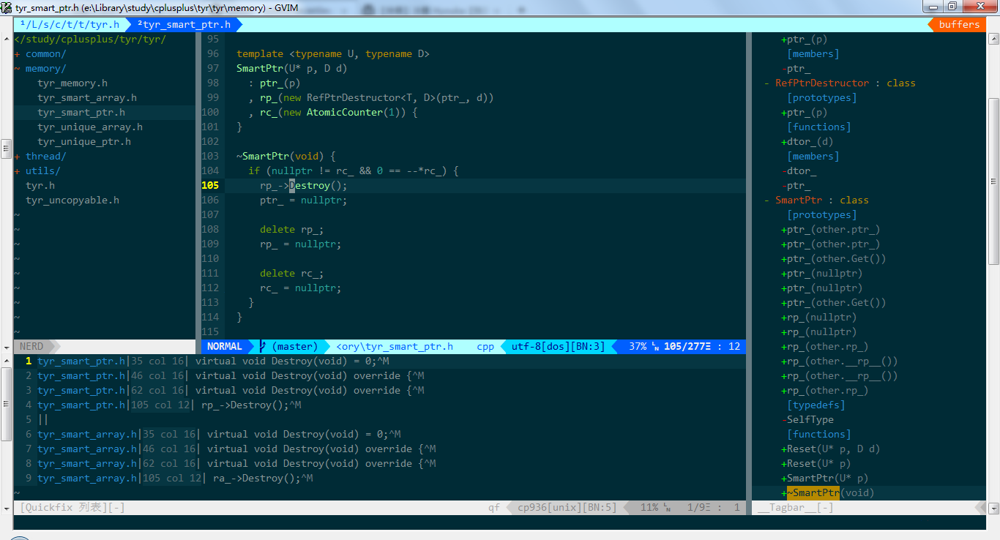
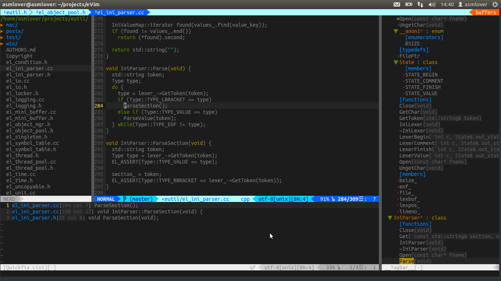

# **eVim**
***

**Configure files for [Vim](https://github.com/vim/vim), built for Windows/Linux and macOS.**

# **Usage**
  * `F8` compile and run a single source file(C/C++)
  * `F9` compile a single source file(C/C++)
  * `F12` making the GVIM window transparent(just for windows platform)
  * `,d` brings up [NERDTree](https://github.com/scrooloose/nerdtree), a sidebar buffer for navigating and manipulating files, opens a fresh NERD tree
  * `,j` brings up [NERDTree](https://github.com/scrooloose/nerdtree), a sidebar buffer for navigating and manipulating files, jump to current file in the NERD tree
  * `,a` starts project search with [ag.vim](https://github.com/rking/ag.vim) using [the silver searcher](https://github.com/ggreer/the_silver_searcher)(like ack, but faster)
  * `,=` begins aligning lines on a string, usually used as `,l=` to align assignments
  * `,]` brings up [tagbar](https://github.com/majutsushi/tagbar), a sidebar buffer for displaying tags
  * `,f` brings up [LeaderF](https://github.com/Yggdroot/LeaderF), quickly locate files, buffers, mrus, ... in large project, launch LeaderF to search files
  * `,p` brings up [LeaderF](https://github.com/Yggdroot/LeaderF), quickly locate files, buffers, mrus, ... in large project, the same as `,f` (or use ctrlp.vim)
  * `,b` brings up [LeaderF](https://github.com/Yggdroot/LeaderF), quickly locate files, buffers, mrus, ... in large project, launch LeaderF to search buffers
  * `,i` display the indention levels with thin vertical lines
  * `,,` display the whitespace(tab or space)
  * `,ev` editing your vimrc($MYVIMRC)
  * `,sv` reloading your vimrc
  * `,gs` key mapping for command `git status`
  * `,gc` key mapping for command `git commit`

# **Install**
## **Windows**
  On Windows [Git](http://msysgit.github.io/), [MinGW](http://www.mingw.org/) and [Clang](http://www.llvm.org/) are required. Also, if you haven't already, you will need to install [Vim](http://www.vim.org/).
  Requires Vim7.3.885+ compiled with [if_lua](http://vimdoc.sourceforge.net/htmldoc/if_lua.html). If :echo has("lua") returns 1, then you're done; otherwise, see below.

  * **Installing dependencies**
    - [Vim 32bit](http://files.kaoriya.net/vim/2013/vim73-kaoriya-win32-20130706.zip)
    - [Vim 64bit](http://files.kaoriya.net/vim/2013/vim73-kaoriya-win64-20130706.zip)
    - [Vim 32bit alternative](https://tuxproject.de/projects/vim/)
    - [Another alternative](http://wyw.dcweb.cn/#download)
    - Install [MinGW](http://www.mingw.org/) to `C:\`
    - [Clang](http://www.llvm.org/)

    **Note:** The Vim build may not include the Lua DLL. In that case, [download lua](http://lua-users.org/wiki/LuaBinaries) and put the `lua52.dll` file in the same directory as `gvim.exe`.
    **Note:** After installing Vim, you need to add it to your environment variable path. Just like:

        \> echo %VIMRUNTIME%
        \> D:\Vim\vim74

  * **Installing eVim**

        \> git clone https://github.com/ASMlover/eVim.git
        \> install.bat

  * **Installing powerline-fonts**

    Copy powerline fonts from .\extra\powerline-fonts into your system fonts directory.

          \> copy /Y .\extras\powerline-fonts\*.* C:\Windows\Fonts

  * **Building YCM**

    If you enbaled plugin ycm(let g:plugin_ycm_enabled=1), you need to build it. Make sure you are installed CMake and setted the environment for using MSVC(VC2013+).

          \> cd ~/.vim/bundle/YouCompleteMe
          \> git submodule update --init --recursive
          \> python install.py --clang-completer

  * **GVim in Windows**
    

## **Linux**
  On Linux [Git](http://git-scm.com/), [Clang](http://clang.llvm.org/) and [ag](https://github.com/ggreer/the_silver_searcher) are required. If you haven't already, you will need to install [Vim](http://www.vim.org/).
  Requires Vim7.3.885+ compiled with [if_lua](http://vimdoc.sourceforge.net/htmldoc/if_lua.html). If :echo("lua") returns 1, then you're done; otherwise, see below.

  * **Installing dependencies**
    - Install ag:

            $ git clone https://github.com/ggreer/the_silver_searcher ag
            $ ./build.sh
            $ sudo make install

    - [vim-7.4.tar.bz2](http://ftp.vim.org/pub/vim/unix/vim-7.4.tar.bz2)
    - Uninstall old Vim:

            $ sudo apt-get autoremove vim vim-runtime vim-tiny vim-common

    - Install vim7.4(Ubuntu):

            $ sudo apt-get install libncurses5-dev
            $ sudo apt-get install libpython
            $ sudo apt-get install liblua5.2-dev
            $ tar jxvf vim-7.4.tar.bz2
            $ cd vim74
            $ ./configure --enable-luainterp --enable-pythoninterp --enable-python3interp --enable-gui=no --without-x --enable-multibyte --with-features=huge
            $ make
            $ sudo make install

  * **Installing eVim**

        $ git clone https://github.com/ASMlover/eVim.git
        $ ./install.sh install

  * **Installing powerline-fonts**

        $ git clone https://github.com/powerline/fonts.git
        $ cd fonts
        $ ./install.sh
        $ sudo cp -R ~/.local/share/fonts /usr/share/fonts
        $ sudo fc-cache -f -v

  * **Building YCM**

    If you enbaled plugin ycm(let g:plugin_ycm_enabled=1), you need to build it.

        $ cd ~/.vim/bundle/YouCompleteMe
        $ ./install.py --clang-completer

  * **Vim in Linux**
    

## **macOS**
  See the document of the Linux part.

  * **Install vim7.4**
    - Append `#include <AvailabilityMacros.h>` into `os_unix.h`
    - Compiling vim7.4

            $ xcode-select --install
            $ tar jxvf vim-7.4.tar.bz2
            $ cd vim74
            $ ./configure --enable-luainterp --enable-pythoninterp=yes --enable-gui=no --without-x --enable-multibyte --with-features=huge --enable-cscope --enable-fontset --enable-perlinterp --enable-rubyinterp --with-python-config-dir=/usr/lib/python2.7/config
            $ make
            $ sudo make install

  * **Installing powerline-fonts**

        $ git clone https://github.com/powerline/fonts.git
        $ cd fonts
        $ ./install.sh

  * **Building YCM**

    If you enbaled plugin ycm(let g:plugin_ycm_enabled=1), you need to build it.

        $ cd ~/.vim/bundle/YouCompleteMe
        $ ./install.py --clang-completer

  * **Vim in macOS**
    
